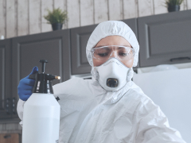

В процессе работы служба дезинсекции домов в Москве использует исключительно зарегистрированные и имеющие разрешение к использованию на территории Российской Федерации препараты III-IV класса опасности. Несмотря на низкий класс опасности, применяемые средства для дезинсекции отличаются высокой эффективностью.

В том случае если необходимый результат не будет достигнут после первого проведения процедуры, служба дезинсекции «Continental Ecoservice» гарантирует повторный, абсолютно бесплатный для клиента, приезд дезинфектора на объект.

## Шаг 1

Обработка поверхностей дезинфицирующим раствором. Все используемые нами препараты относятся к III и IV классу опасности, сертифицированы и разрешены к использованию на территории Российской Федерации, соответствуют СП 3.5.3.3223-14, СанПиН 3.5.2.3472-17.

